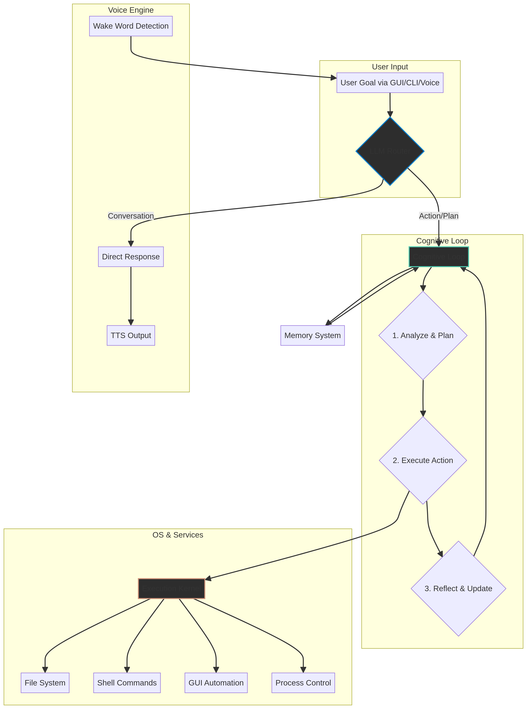

# LUNA AI Agent - v5.0
Author: IRFAN

**LUNA (Latent Understanding & Neural Architecture)** is a fully autonomous, cross-platform cognitive operating system layer. This repository contains the complete source code for LUNA v5.0, featuring a deep architectural upgrade for cross-platform automation, always-on voice control, and a professional GUI.



---

## Key Features

| Feature                  | Description                                                                                                                              |
| ------------------------ | ---------------------------------------------------------------------------------------------------------------------------------------- |
| **Unified Brain**        | Cognitive routing for conversation, action, and planning with a standardized JSON contract and auto-repair.                              |
| **OS Abstraction**       | Native support for Linux, Windows, and macOS via platform-specific adapters.                                                              |
| **Interaction Engine**   | Advanced keyboard, mouse, window, and multi-browser (Chrome, Firefox, Edge, Brave) automation.                                           |
| **Always-on Voice**      | Passive wake word listening ("Luna") and active command capture in a non-blocking background thread.                                     |
| **Professional GUI**     | Real-time monitoring of system resources, token usage, execution timeline, and a built-in config editor.                                 |
| **Advanced Memory**      | Multi-layered memory (short-term, episodic, long-term) with intelligent LLM-based compression.                                           |
| **Docker Support**       | Fully containerized environment with all system dependencies and Playwright pre-configured.                                              |

---

## Installation

### Prerequisites
- Python 3.11+
- `pip` for package installation

### Linux
```bash
sudo apt install portaudio19-dev ffmpeg xdotool wmctrl playerctl libasound2-dev
pip install -r requirements.txt
playwright install
```

### Windows
- Install Visual C++ Redistributable
- Install FFmpeg
- `pip install -r requirements.txt`
- `playwright install`

### macOS
```bash
brew install portaudio ffmpeg
pip install -r requirements.txt
playwright install
```

---

## Usage

### Running LUNA
To start the agent with the GUI:
```bash
python main.py
```

### Docker
Build and run the containerized version:
```bash
docker build -t luna-agent .
docker run -it luna-agent
```

---

## Architectural Upgrade Summary (v5.0)

| Phase | Module(s) Affected | Key Upgrades Implemented |
| :--- | :--- | :--- |
| **1. Stabilization** | `core/loop.py`, `llm/router.py` | - Unified LLM Brain contract.<br>- Immediate conversational response.<br>- JSON repair fallback (1 retry). |
| **2. OS Abstraction** | `os_adapters/`, `execution/kernel.py` | - Platform-specific adapters (Linux, Win, Mac).<br>- Auto-detection of host OS. |
| **3. Interaction** | `execution/kernel.py` | - Keyboard/Mouse automation.<br>- Multi-browser support.<br>- Media control abstraction. |
| **4. Voice System** | `voice/engine.py` | - Always-on passive listening.<br>- Wake word "Luna" with immediate acknowledgment. |
| **5. Memory** | `memory/system.py` | - Episodic task memory.<br>- Token usage tracking.<br>- Auto-compression via LLM. |
| **6. GUI** | `gui/monitor.py` | - Resource monitor (CPU/RAM).<br>- Execution timeline.<br>- Built-in config editor. |
| **7. Orchestration** | `config.yaml` | - Multi-provider LLM support.<br>- Configurable iteration limits. |
| **8 & 9. Deployment** | `requirements.txt`, `Dockerfile` | - Clean dependency separation.<br>- Full Docker support with Playwright. |
